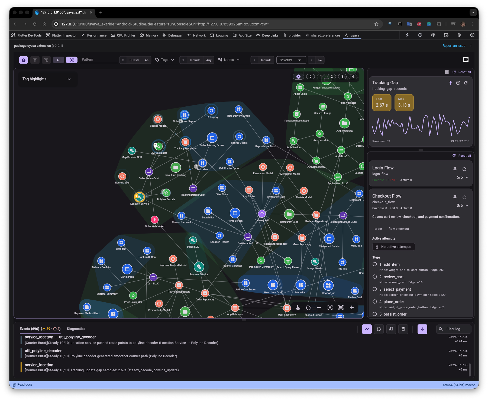

# Uyava DevTools Extension

[](https://github.com/alex-marochko/uyava/actions/workflows/ci.yml)

<p>
  
</p>

Uyava is a Flutter DevTools extension for live runtime visibility: architecture graph, event journal, diagnostics, metrics, and event chains in one UI.

Status: Public Beta.

“Uyava” means “imagination” in Ukrainian (pronounced “oo-YAH-vah”).

## Why use Uyava

Uyava helps you move from flat logs to a living architecture view during Flutter debugging.

It is designed to help you:

- Turn runtime activity into an interactive architecture map.
- Follow event paths and cross-feature chain reactions with less guesswork.
- Inspect nodes, relationships, and metrics in one place instead of jumping between tools.
- Reproduce tricky bugs quickly by replaying sessions captured by QA (Desktop workflow).
- Onboard new developers faster with a living system map instead of stale text docs.

## Preview



### Key capabilities in this DevTools extension

- Live architecture graph (nodes, edges, hierarchy).
- Runtime event journal with severity and payload details.
- Diagnostics panel for integrity/validation issues.
- Metrics dashboard for runtime samples and aggregates.
- Event chains for multi-step flow tracking.
- Filtering, focus, and grouping controls for large graphs.
- Optional console mirroring via SDK (`Uyava.enableConsoleLogging(...)`).

## What this package is

- DevTools extension UI that reads Uyava SDK events from VM Service.
- A companion to the `uyava` SDK (instrumentation happens in your app code).
- Best for live debug/profile sessions directly in Flutter DevTools.

For offline replay of `.uyava` logs and desktop workflows, see the desktop docs:
- [Installation](https://uyava.io/docs/installation)
- [Recording and .uyava Logs](https://uyava.io/docs/recording-logs)

## Quick start (Flutter app)

1. Add the SDK to your app:

```bash
flutter pub add uyava
```

2. Initialize and publish an initial graph:

```dart
import 'package:flutter/widgets.dart';
import 'package:uyava/uyava.dart';

void main() {
  WidgetsFlutterBinding.ensureInitialized();
  Uyava.initialize();

  Uyava.replaceGraph(
    nodes: const [
      UyavaNode(id: 'ui.login', type: 'screen', label: 'Login', tags: ['ui']),
      UyavaNode(id: 'logic.auth', type: 'service', label: 'Auth', tags: ['auth']),
    ],
    edges: const [
      UyavaEdge(id: 'ui.login->logic.auth', from: 'ui.login', to: 'logic.auth'),
    ],
  );

  runApp(const MyApp());
}
```

3. Emit runtime events:

```dart
Uyava.emitNodeEvent(
  nodeId: 'logic.auth',
  message: 'Sign in pressed',
  severity: UyavaSeverity.info,
);

Uyava.emitEdgeEvent(
  edge: 'ui.login->logic.auth',
  message: 'Auth request dispatched',
  severity: UyavaSeverity.info,
);
```

`message` must be non-empty for both `emitNodeEvent` and `emitEdgeEvent`.

4. Optional: mirror Uyava events to your app console:

```dart
Uyava.enableConsoleLogging(
  config: UyavaConsoleLoggerConfig(minLevel: UyavaSeverity.info),
);
```

5. Run app in debug/profile mode, open Flutter DevTools, and select the **Uyava** extension tab.

## Lifecycle signals (recommended)

Use lifecycle state updates to reflect what is currently active in your app:

```dart
Uyava.updateNodeLifecycle(
  nodeId: 'logic.auth',
  state: UyavaLifecycleState.initialized,
);

Uyava.updateNodesListLifecycle(
  nodeIds: ['logic.auth', 'data.session'],
  state: UyavaLifecycleState.disposed,
);

Uyava.updateSubtreeLifecycle(
  rootNodeId: 'feature.checkout',
  state: UyavaLifecycleState.disposed,
  includeRoot: true,
);
```

This keeps the graph stable while still showing real runtime activation/deactivation.

## Metrics and event chains

Define metrics once, then send samples inside event payloads:

```dart
Uyava.defineMetric(
  id: 'auth.latency_ms',
  label: 'Auth latency',
  unit: 'ms',
  tags: ['auth', 'latency'],
  aggregators: [
    UyavaMetricAggregator.last,
    UyavaMetricAggregator.max,
    UyavaMetricAggregator.sum,
    UyavaMetricAggregator.count,
  ],
);

Uyava.emitNodeEvent(
  nodeId: 'logic.auth',
  message: 'Auth latency sample',
  payload: {
    'metric': {'id': 'auth.latency_ms', 'value': 180},
  },
);
```

Define event chains for multi-step flows:

```dart
Uyava.defineEventChain(
  id: 'auth.login_flow',
  label: 'Login flow',
  tags: ['auth'],
  steps: const [
    UyavaEventChainStep(stepId: 'open', nodeId: 'ui.login'),
    UyavaEventChainStep(stepId: 'submit', nodeId: 'logic.auth'),
    UyavaEventChainStep(stepId: 'success', nodeId: 'logic.auth'),
  ],
);
```

Rules:
- `id` must be unique and stable.
- At least one tag is required (`tags` preferred, legacy `tag` is supported).
- Step IDs must be unique within the chain.

Progress/failure events are emitted via `emitNodeEvent(..., payload: {'chain': ...})`.
Failure is detected by `chain.status = failed|failure` (and top-level `payload.status` is accepted as compatibility fallback).

## SDK file logging (record in your app)

If you need shareable `.uyava` files from app-side instrumentation, enable SDK file logging:

```dart
import 'package:path_provider/path_provider.dart';
import 'package:uyava/uyava.dart';

Future<void> startLogging() async {
  final dir = await getApplicationDocumentsDirectory();
  await Uyava.enableFileLogging(
    config: UyavaFileLoggerConfig(directoryPath: dir.path),
  );
}
```

Then you can export a sealed archive for sharing/replay:

```dart
final archive = await Uyava.exportCurrentArchive();
```

Desktop can open the exported `.uyava` file in File mode for replay.

## Best practices (short)

- Build a mostly static graph skeleton at startup (`replaceGraph`), then use events/lifecycle for runtime changes.
- Keep node/edge IDs stable and unique.
- Avoid one synthetic global root for the entire graph; prefer meaningful top-level feature/domain roots.
- Keep runtime data in event payloads (and metrics), not in graph structure.
- Use non-empty event messages and, where useful, `sourceRef: Uyava.caller()` for code navigation.
- Control noisy event streams with sampling/aggregation so the UI stays readable.

## Installing the extension itself

- Public path: install from the Flutter DevTools Extensions catalog (after listing is live).
- Contributor path (local build/copy):

```bash
cd <repo>/.../uyava_devtools_extension
flutter pub run devtools_extensions build_and_copy \
  --source=. \
  --dest=<host-project>/extension/devtools
```

## Quick troubleshooting

- No data in DevTools: ensure `Uyava.initialize()` runs before `runApp`, and run app in debug/profile mode.
- No console mirror output: check `minLevel`, `includeTypes` / `excludeTypes`, and whether `disableConsoleLogging()` was called.
- Need a shareable log file from app-side recording: call `Uyava.exportCurrentArchive()`.

## Documentation

- Getting started: [uyava.io/docs/getting-started](https://uyava.io/docs/getting-started)
- SDK integration reference: [uyava.io/docs/sdk-integration](https://uyava.io/docs/sdk-integration)
- Installation: [uyava.io/docs/installation](https://uyava.io/docs/installation)

## Additional info

- Graph model and styling rules: [uyava.io/docs/concepts-graph](https://uyava.io/docs/concepts-graph)
- Filters, focus, and grouping behavior: [uyava.io/docs/concepts-filtering](https://uyava.io/docs/concepts-filtering)
- Journal and diagnostics details: [uyava.io/docs/journal-diagnostics](https://uyava.io/docs/journal-diagnostics)
- Session file wire format (`.uyava`): [uyava.io/docs/session-file-format](https://uyava.io/docs/session-file-format)
- Recording/replay workflows: [uyava.io/docs/recording-logs](https://uyava.io/docs/recording-logs)
- Under the hood (architecture): [uyava.io/docs/architecture](https://uyava.io/docs/architecture)

## Links

- Website: [uyava.io](https://uyava.io)
- Repository: [github.com/alex-marochko/uyava](https://github.com/alex-marochko/uyava)
- Issue tracker: [github.com/alex-marochko/uyava/issues](https://github.com/alex-marochko/uyava/issues)

## License

MIT. See [LICENSE](LICENSE).
